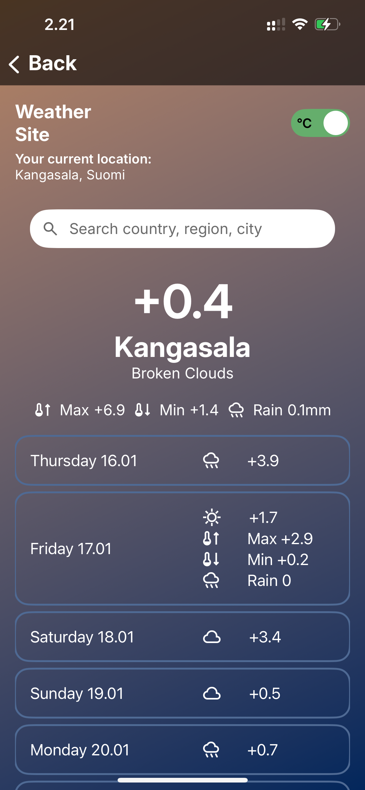

# Weather App for iOS with Swift



A simple and modern SwiftUI-based weather application that provides real-time weather updates for your current location or any selected location. The app integrates with a weather API and displays both current and future weather conditions in an intuitive user interface.

## Features

- **Current Weather**: View the current temperature, weather conditions, and location.
- **Daily Forecast**: Get weather predictions for the upcoming days.
- **Location Search**: Search for and select any city or location worldwide.
- **Unit Toggle**: Switch between Metric and Imperial temperature units.

## Technologies Used

- **SwiftUI**: For building the user interface.
- **CoreLocation**: For fetching the user's current location.
- **URLSession**: For making network requests to fetch weather data.
- **OpenWeather API**: To retrieve weather data (requires an API key).

## Requirements

- iOS 17.0 or later
- Xcode 16.0 or later
- An active internet connection
- A OpenWeatherMap API key

## Installation

1. Clone the repository:
   ```bash
   git clone https://github.com/CaOs433/qvik-weather-swift.git
   cd qvik-weather-swift
   ```
2. Open the project in Xcode:
   ```bash
   open Qvik-Weather-Swift.xcodeproj
   ```
3. Build and run the project on a simulator or a physical device.
4. Type your OpenWeatherMap API key in the start screen and tap save.

## Usage

1. **Current Location Weather**: Allow location access to fetch weather for your current location.
2. **Search Location**: Tap on the search bar to find and select a location.
3. **Switch Temperature Unit**: Use the toggle in the top-right corner to switch between Celsius (°C) and Fahrenheit (°F).
4. **Scroll for More Info**: Scroll down to see the weekly forecast and additional weather details.

## OpenWeatherMap API

The app uses OpenWeatherMap's API and you need your own API key. You can get your API key from here: [https://openweathermap.org/api](https://openweathermap.org/api).

## Testing

Work in progress!

The app includes a few unit tests.

To run tests:

1. Open the project in Xcode.
2. Select `Product` > `Test` or press `Cmd + U`.

## Future Improvements

- Add support for hourly forecasts.
- Provide user preferences for theme customization.
- Implement offline caching for weather data.
